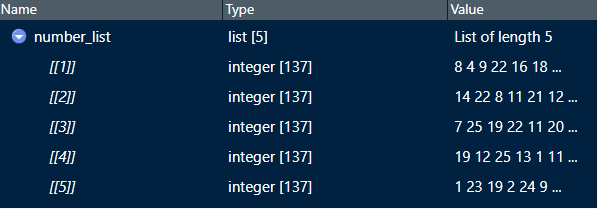
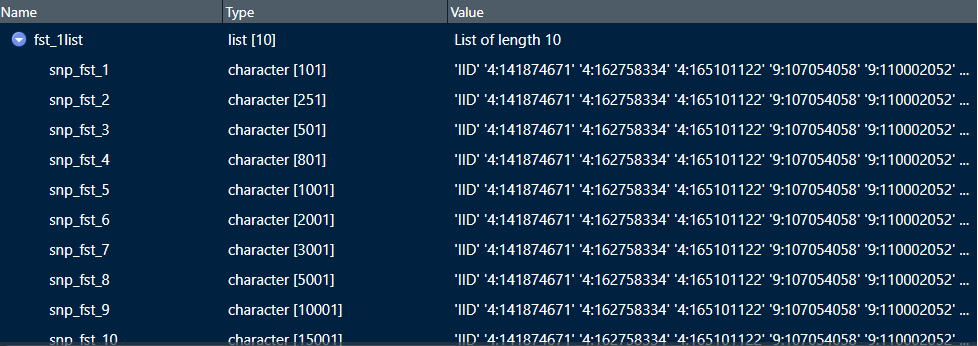
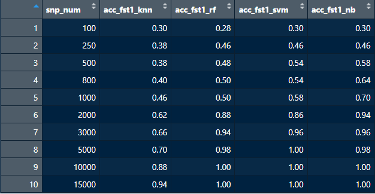
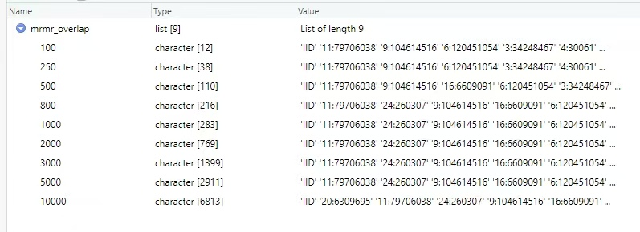
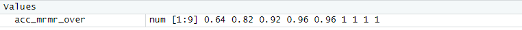

# Machine learning based on informational SNPS for population assignment

# **1. Introduction**

In this study, we aim to develop an informative SNP panel for population assignment using WGS data, by evaluating three SNP selection methods (FST, mRMR, and Relief-F) combined with four popular machine learning classifiers (KNN, RF, SVM, and NB) . The goal is to determine the most effective approach for population assignment, particularly in cases of low genetic differentiation among populations.

# **2. Workflow**

# **3. The main contents**

The main components include population genetic analysis, genotype imputation using Beagle, SNP selection and population assignment, as well as the development of a SNP panel for accurate population discrimination.The quality-controlled whole-genome SNP variant dataset (VCF file) used in this study is available at: [https://doi.org/10.6084/m9.figshare.28235453.v1](https://doi.org/10.6084/m9.figshare.28235453.v1).

## **Population genetics analysis**

Principal component analysis (PCA) and pairwise FST value calculation were performed using Plink. ADMIXTURE v1.3 software was used to infer the proportion of ancestry in the tested population with K values ranging from 2 to 6. For phylogenetic analysis, the NJ tree was constructed based on IBD distance and visualized using the online iTOL tool.

The script `population_genetic_analysis.sh` was used for population genetic structure analysis, including PCA, ADMIXTURE, and NJ tree analyses.
  * Input files:
    * Buffalo_187_HC_pass_simplify_num_qc_indep.bed(The quality-controlled SNP variant dataset in PLINK ".bed" format.)
      

## **Genotype imputation using Beagle**

Missing genotypes were imputed using Beagle software with the parameters "iterations=50" and "window=50".

The script `Imputation_Beagle.sh` was used for genotype imputation of the SNP variant dataset.
  * Input files:
    * Buffalo_187_HC_pass_simplify_num_qc_indep.bed
  * Output files:
    * Buffalo_187_HC_pass_simplify_num_qc_indep_fix.bed(The imputed SNP variant dataset in PLINK ".bed" format)

## **SNP selection and population assignment**

A genetic approach (FST) and two machine learning algorithms (mRMR and Relief-F) were employed to identify highly breed-informative markers. Four widely used machine learning classifiers, Random Forest (RF), Support Vector Machine (SVM), K-Nearest Neighbor (KNN), and Naive Bayes (NB), were applied to perform population assignment.

### **Division of training and testing sets**

The script `data_partitioning_prepare.R` was utilized to generate the training and testing set lists. Within this script, 187 buffaloes from eight breeds were randomly partitioned into training and testing sets using R. The output was saved as `trainset_list.RData`, which contains sample ID lists for the five training sets.
* Output files:
  * trainset_list.RData(Sample ID lists for the five training sets)

  

### **FST+RF-SVM-KNN-NB**

This section first selected SNPs using the FST method, followed by breed identification with four machine learning approaches (KNN, RF, SVM, and NB), and subsequently evaluated classification accuracy.The script was executed following the workflow below.

- **Calculate FST**
    
    Plink was used to calculate the FST of SNPs from the river-type and swamp-type buffalo datasets based on whole-genome resequencing data, which was subsequently used for SNP locus selection. 
    
    The script `01_fst_calculate_prepare.sh` used PLINK to calculate FST values for the SNP datasets of all buffalo, river-type buffalo, and swamp-type buffalo, respectively.
    * Input files:
      * Buffalo_187_HC_pass_simplify_num_qc_indep_fix.bed
      * buffalo_3col.list(Three columns: the first two contain sample IDs, and the third indicates the breed)
      * buffalo_river.list(List of river-type buffalo samples)
      * buffalo_swamp.list(List of swamp-type buffalo samples)
    * Output files:
      * Buffalo_187_HC_pass_simplify_num_qc_indep_fix.fst(FST for all buffalo)
      * Buffalo_187_HC_pass_simplify_num_qc_indep_fix_swamp.fst(FST of swamp-type buffalo)
      * Buffalo_187_HC_pass_simplify_num_qc_indep_fix_river.fst(FST of river-type buffalo)
    
- **Filter SNPs**
    
    Based on the FST ranking, the top 40,000 SNPs were selected to generate input files for subsequent breed clustering. 
    
    The script `02_fst_filtrate_prepare.sh` ranks SNPs by FST, selects the top 40,000 loci, and extracts input files for subsequent breed clustering.

    * Input files:
      * Buffalo_187_HC_pass_simplify_num_qc_indep_fix.bed
      * buffalo_snplist.list(List of the top 40,000 SNP IDs ranked by FST)
      * buffalo_3col.list
    * Output files:
      * Buffalo_187_HC_pass_simplify_num_qc_indep_fix_4k.raw(PLINK ".raw" format of the SNP dataset comprising the top 40,000 loci ranked by FST)
      * Buffalo_187_HC_pass_simplify_num_qc_indep_fix_4k.bed(PLINK ".bed" format of the SNP dataset comprising the top 40,000 loci ranked by FST)
    
- **Population classification**
    Population classification was performed using four different machine learning methods. Nine different SNP set sizes (100, 250, 500, 800, 1000, 2000, 3000, 5000, 10000) were examined.
    
    The script `03_FST+RF-SVM-KNN-NB.R` applied four different machine learning methods for population classification.
    * Input files
      * Buffalo_187_HC_pass_simplify_num_qc_indep_fix_4k.raw
      * buffalo_3col.list
      * trainset_list.RData
      * Buffalo_187_HC_pass_simplify_num_qc_indep_fix_out.fst
    * Output files
      * SNP lists selected by the FST method from five training sets (e.g., snp_fst1_list.RData, which contains SNP lists with varying sizes)
 
        
      
      * Classification accuracy files (e.g., acc_fst1_10.RData, which contains classification accuracy of four machine learning classifiers based on SNP lists of varying sizes)
 
        
      

### **mRMR+RF-SVM-KNN-NB**

This section first selected SNPs using the mRMR method, followed by breed identification with four machine learning approaches (KNN, RF, SVM, and NB), and subsequently evaluated classification accuracy. Nine different SNP set sizes (100, 250, 500, 800, 1000, 2000, 3000, 5000, 10000) were examined.

The script `mRMR+RF-SVM-KNN-NB.R` applied four different machine learning methods for population classification.
  * Input files:
    * Buffalo_187_HC_pass_simplify_num_qc_indep_fix_4k.raw
    * buffalo_3col.list
    * trainset_list.RData
  * Output files:
    * SNP lists selected by the mRMR method from five training sets (e.g., snp_mrmr1_list.RData, which contains SNP lists with varying sizes)
    * Classification accuracy files (e.g., acc_mrmr1_10.RData, which contains classification accuracy of four machine learning classifiers based on SNP lists of varying sizes)
    

### **Relief-F+RF-SVM-KNN-NB**

This section first selected SNPs using the Relief method, followed by breed identification with four machine learning approaches (KNN, RF, SVM, and NB), and subsequently evaluated classification accuracy. Nine different SNP set sizes (100, 250, 500, 800, 1000, 2000, 3000, 5000, 10000) were examined.

The script `Relief-F+RF-SVM-KNN-NB.R` applied four different machine learning methods for population classification.
  * Input files:
    * Buffalo_187_HC_pass_simplify_num_qc_indep_fix_4k.raw
    * buffalo_3col.list
    * trainset_list.RData
  * Output files:
    * SNP lists selected by the Relief method from five training sets (e.g., snp_relf1_list.RData, which contains SNP lists with varying sizes)
    * Classification accuracy files (e.g., acc_relf1_10.RData, which contains classification accuracy of four machine learning classifiers based on SNP lists of varying sizes)

## The development and evaluation of the SNP panel

We identified the SNP set with the highest classification accuracy and the fewest selected SNPs by combining the optimal SNP selection method(mRMR) with the best-performing machine learning classifier(SVM).The script was executed following the workflow below.

### **Development of the SNP panel**

The intersection of SNPs identified by the mRMR method across the five training sets was extracted in the R environment.

The script `01_SNPpanel.development.R` was used to extract the intersection of SNP lists selected by the mRMR method from five training sets.
  * Input files:
    * SNP lists selected by the mRMR method from five training sets (e.g., `snp_mrmr1_list.RData`).
  * Output files:
    * mrmr_SNPoverlap.RData(Intersections of SNPs from the five training sets across different set sizes)

      
    

### **Evaluation of the SNP panel**

Based on the intersected SNP dataset, breed classification was performed using the Support Vector Machine (SVM) algorithm. Classification accuracy was calculated, and a confusion matrix was generated to evaluate the classification performance of the SNP set.

The script `02_SNPpanel.evaluation.R` applied the SVM algorithm for breed classification and calculated classification accuracy to evaluate the performance of the SNP panel.
  * Input files:
    * Buffalo_187_HC_pass_simplify_num_qc_indep_fix_4k.raw
    * buffalo_3col.list
    * trainset_list.RData
    * mrmr_SNPoverlap.RData
  * Output files:
    * acc_mrmr_overlap.RData(Classification accuracy of the intersected SNP dataset, which the classification accuracy of SNP panels with varying marker set sizes)

      
    
